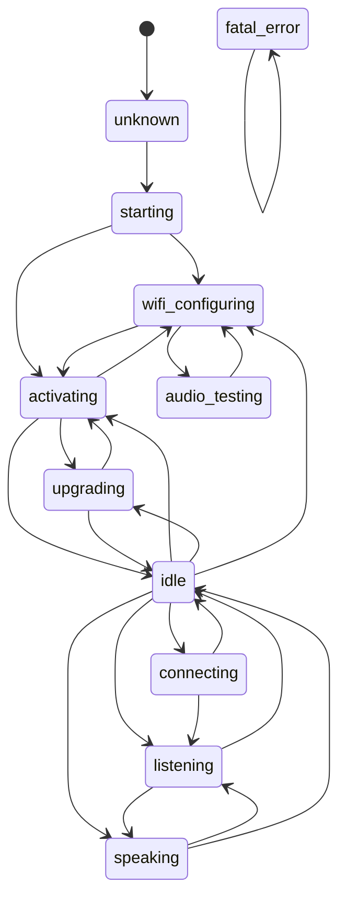
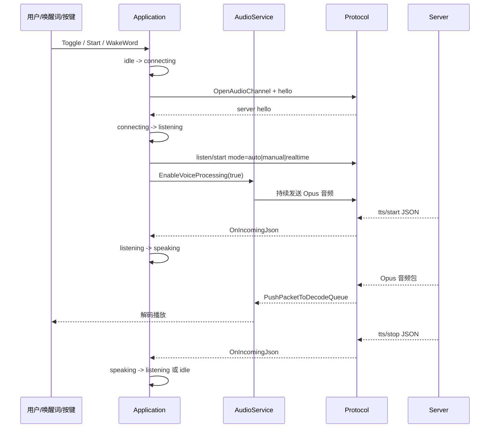

# ESP32-S3-Korvo-1 音频链路分析

本文重点分析 `main/audio` 和 `main/boards/esp32s3-korvo-1` 目录中的音频链路，覆盖：

- 采集 -> Opus 编码 -> 上传服务器
- 接收服务器音频 -> Opus 解码 -> 播放
- 系统状态机
- 用户说话结束的判定方式

## 关键结论

`xiaozhi-esp32` 当前代码中，“用户是否说话结束”主要不是由本地 VAD 最终决策。本地 AFE VAD 会判断当前是否有语音，并更新 `voice_detected_` 与 LED/UI 状态，但不会在检测到静音时自动发送 `listen/stop`。

自动对话模式下，设备进入 `listening` 后持续上传 60 ms Opus 音频包，服务器根据上行音频做端点检测。服务器确认用户说完并开始生成回复后，会下发 `tts/start`，设备再从 `listening` 切到 `speaking`。

## Korvo-1 板级音频结构

ESP32-S3-Korvo-1 使用两条 I2S：

- 播放：I2S0 -> ES8311 -> PA -> Speaker
- 录音：I2S1 <- ES7210 <- 3 Mic + Reference

配置位于 `main/boards/esp32s3-korvo-1/config.h`：

- `AUDIO_INPUT_SAMPLE_RATE = 16000`
- `AUDIO_OUTPUT_SAMPLE_RATE = 16000`
- `AUDIO_INPUT_CHANNELS = 2`
- `AUDIO_INPUT_RAW_CHANNELS = 4`

`Korvo1AudioCodec` 底层实际从 ES7210 读 4 路 raw lane：

```text
raw[4*i + 0] = Reference
raw[4*i + 1] = Mic0
raw[4*i + 2] = Mic1
raw[4*i + 3] = Mic2
```

然后通过 `Korvo1MicArrayProcessor::ProcessRaw()` 将 3 路麦克风做麦阵处理，向公共音频链路输出 2 路：

```text
M/R = 增强后的主声源 Mic + Reference
```

这样后级 AFE 看到的是一路语音输入加一路回采参考，便于做 AEC/NS/VAD。

关键源码：

- `main/boards/esp32s3-korvo-1/config.h`
- `main/boards/esp32s3-korvo-1/korvo1_audio_codec.cc`
- `main/boards/esp32s3-korvo-1/korvo1_mic_array_processor.cc`

## 上行链路：采集到上传

```mermaid
flowchart LR
  Mic[3 Mic + Reference/ES7210] --> I2S1[I2S1 32-bit stereo raw]
  I2S1 --> KCodec[Korvo1AudioCodec::Read]
  KCodec --> Array[Korvo1MicArrayProcessor<br/>4 路 raw -> M/R 两路]
  Array --> AS[AudioService::ReadAudioData<br/>10 ms / 16 kHz]
  AS --> AFE[AfeAudioProcessor<br/>AEC / NS / VAD / fetch]
  AFE --> PCM60[60 ms mono PCM]
  PCM60 --> EncQ[audio_encode_queue_]
  EncQ --> Opus[esp_opus_enc_process]
  Opus --> SendQ[audio_send_queue_]
  SendQ --> App[Application MAIN_EVENT_SEND_AUDIO]
  App --> Proto[Protocol::SendAudio]
  Proto --> Server[WebSocket binary 或 MQTT + UDP]
```



### 1. AudioInputTask 读取 10 ms PCM

`AudioService::AudioInputTask()` 在唤醒词检测或语音处理运行时，每次读取 10 ms 音频：

```cpp
int samples = 160; // 10ms
ReadAudioData(data, 16000, samples)
```

读取完成后：

- 如果唤醒词检测运行，调用 `wake_word_->Feed(data)`
- 如果语音处理运行，调用 `audio_processor_->Feed(std::move(data))`

### 2. AFE 输出 60 ms PCM

`AfeAudioProcessor` 初始化时使用 `OPUS_FRAME_DURATION_MS`，当前为 60 ms。AFE 内部按自身 chunk 大小 feed/fetch，最终将输出缓存聚合成 60 ms mono PCM，再回调：

```cpp
audio_processor_->OnOutput([this](std::vector<int16_t>&& data) {
    PushTaskToEncodeQueue(kAudioTaskTypeEncodeToSendQueue, std::move(data));
});
```

### 3. OpusCodecTask 编码

`AudioService::OpusCodecTask()` 从 `audio_encode_queue_` 取 60 ms PCM，调用：

```cpp
esp_opus_enc_process(opus_encoder_, &in, &out)
```

编码参数在 `AS_OPUS_ENC_CONFIG()` 中定义：

- 16 kHz
- mono
- 16 bit
- 60 ms frame
- VBR enabled
- DTX enabled

编码后的包进入 `audio_send_queue_`，随后触发 `on_send_queue_available`，主循环通过 `MAIN_EVENT_SEND_AUDIO` 调用 `protocol_->SendAudio()`。

### 4. 协议上传

WebSocket 模式：

- `WebsocketProtocol::SendAudio()`
- 按协议版本封装二进制包
- version 2 带 timestamp，version 3 使用 `BinaryProtocol3`

MQTT/UDP 模式：

- MQTT 负责文本控制消息
- UDP 负责音频包
- `MqttProtocol::SendAudio()` 使用 AES-CTR 加密后通过 UDP 发送

## 下行链路：服务器音频到播放


### 1. 协议接收音频

`Application::InitializeProtocol()` 注册 `OnIncomingAudio`：

```cpp
protocol_->OnIncomingAudio([this](std::unique_ptr<AudioStreamPacket> packet) {
    if (GetDeviceState() == kDeviceStateSpeaking) {
        audio_service_.PushPacketToDecodeQueue(std::move(packet));
    }
});
```

也就是说，服务器下行音频只有在设备处于 `speaking` 状态时才进入解码队列。

### 2. OpusCodecTask 解码

`AudioService::OpusCodecTask()` 从 `audio_decode_queue_` 取包，按服务器 hello 中给出的 `sample_rate` 和 `frame_duration` 设置 decoder，然后调用：

```cpp
esp_opus_dec_decode(opus_decoder_, &raw, &out_frame, &dec_info)
```

如果服务器采样率与本机输出采样率不同，会通过 `output_resampler_` 重采样。

### 3. AudioOutputTask 播放

解码后的 PCM 进入 `audio_playback_queue_`。`AudioOutputTask()` 取出后调用：

```cpp
codec_->OutputData(task->pcm);
```

对 Korvo-1 来说最终进入：

```cpp
Korvo1AudioCodec::Write()
esp_codec_dev_write(output_dev_, data, samples * sizeof(int16_t))
```

## 系统状态机

状态枚举位于 `main/device_state.h`，合法迁移位于 `main/device_state_machine.cc`。



主对话路径如下：



## 状态进入动作

`Application::HandleStateChangedEvent()` 中定义了关键状态动作。

### idle

- 显示待机
- 清空聊天消息
- `EnableVoiceProcessing(false)`
- `EnableWakeWordDetection(true)`

### listening

- 显示 Listening
- 如果语音处理未运行，先发送 `listen/start`
- `EnableVoiceProcessing(true)`
- 通常关闭 listening 状态下的唤醒词检测，除非配置了 `CONFIG_WAKE_WORD_DETECTION_IN_LISTENING`

### speaking

- 显示 Speaking
- 非 realtime 模式下关闭语音处理
- 仅允许 AFE 唤醒词在 speaking 中继续检测
- `ResetDecoder()` 清理旧下行音频

## 用户说话结束如何判定

### 本地 VAD 的作用

`AfeAudioProcessor::AudioProcessorTask()` 从 AFE fetch 结果中读取 `res->vad_state`：

```cpp
if (res->vad_state == VAD_SPEECH && !is_speaking_) {
    is_speaking_ = true;
    vad_state_change_callback_(true);
} else if (res->vad_state == VAD_SILENCE && is_speaking_) {
    is_speaking_ = false;
    vad_state_change_callback_(false);
}
```

这个回调最终进入：

- `AudioService::voice_detected_`
- `Application::MAIN_EVENT_VAD_CHANGE`
- LED/UI 刷新

但是源码中没有看到“VAD 从 speech 变 silence 后自动调用 `SendStopListening()`”的逻辑。

### 自动停止由服务器完成

设备进入 listening 时发送：

```json
{"type":"listen","state":"start","mode":"auto"}
```

随后设备持续上传 Opus 音频。服务器根据音频流做端点检测。当服务器认为用户说话结束并开始回复时，会下发：

```json
{"type":"tts","state":"start"}
```

设备收到后：

```cpp
SetDeviceState(kDeviceStateSpeaking);
```

这表示自动模式下，一轮用户输入结束的最终判定在服务器侧。

### 手动停止路径

如果是手动模式或用户主动停止，`Application::HandleStopListeningEvent()` 会调用：

```cpp
protocol_->SendStopListening();
SetDeviceState(kDeviceStateIdle);
```

此时设备会显式发送：

```json
{"type":"listen","state":"stop"}
```

## 关键源码索引

- `main/audio/audio_service.h`
  - 队列、Opus frame、事件位、AudioStreamPacket 流转
- `main/audio/audio_service.cc`
  - `AudioInputTask()`
  - `AudioOutputTask()`
  - `OpusCodecTask()`
  - `EnableVoiceProcessing()`
  - `PushPacketToDecodeQueue()`
  - `PopPacketFromSendQueue()`
- `main/audio/processors/afe_audio_processor.cc`
  - AFE 初始化
  - VAD 状态回调
  - 60 ms PCM 聚合输出
- `main/boards/esp32s3-korvo-1/korvo1_audio_codec.cc`
  - ES8311/ES7210 初始化
  - I2S0 播放
  - I2S1 录音
  - raw 4 路到 M/R 两路
- `main/boards/esp32s3-korvo-1/korvo1_mic_array_processor.cc`
  - 三麦阵列处理
  - MASE 或 fallback beamforming
  - 输出增强 Mic + Reference
- `main/application.cc`
  - 状态变更动作
  - 协议回调
  - `listen/start`
  - `tts/start` / `tts/stop` 状态切换
- `main/device_state_machine.cc`
  - 合法状态迁移
- `main/protocols/protocol.cc`
  - `listen/start`
  - `listen/stop`
  - `abort`
- `main/protocols/websocket_protocol.cc`
  - WebSocket 音频收发
- `main/protocols/mqtt_protocol.cc`
  - MQTT 控制消息
  - UDP 加密音频收发
